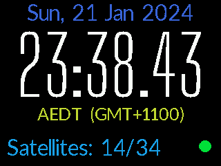
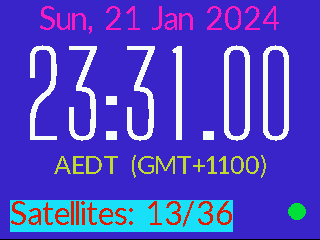
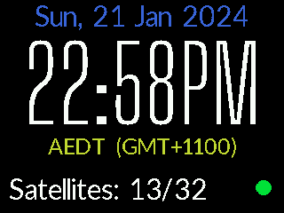
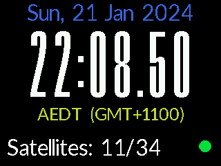
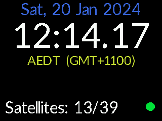
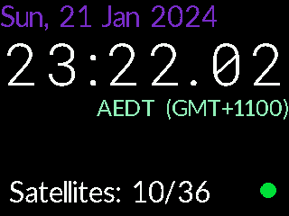

# fbgpsclock
Draw time and GPS information on a framebuffer display.

<p><a href="images/screenshot-bigshoulders.png">
  
</a><br/>

*   [Features](#features)
*   [Usage](#usage)
    +   [Requirements](#requirements)
    +   [Build & Install](#build---install)
    +   [Configuration](#configuration)
    +   [Status Indicator](#status-indicator)
*   [Fonts](#fonts)
    +   [Creating Font Headers](#creating-font-headers)
*   [To Do](#to-do)
*   [Links](#links)

This has been built and tested on an Orange Pi Zero with an ST7789V-based
SPI TFT screen, as part of a [GPS-disciplined NTP server][Orange-Pi-Zero-GPS-NTP]
project. It should, however, be fairly portable.


## Features
-   get time information from system
-   get GPS information from _gpsd_ shared memory
-   draw time, date, timezone, satellite count and GPS status on the screen
-   configure position, colour and format of display elements from an INI file
-   use bitmap header fonts, allowing different heights and widths (including
      variable width fonts)
-   control screen brightness via backlight PWM
-   flash the status symbol in time with the PPS signal


## Usage
### Requirements
_gpsd_ needs to be installed and configured:
```sh
sudo apt install gpsd

# optional tools
sudo apt install gpsd-tools pps-tools
```

The configuration of _gpsd_ will vary between setups, but using
[Orange Pi Zero GPS NTP][Orange-Pi-Zero-GPS-NTP] as an example (with
the GPS connected as a 115.2k serial device at _/dev/ttyS2_ and the
PPS at _/dev/pps0_):

##### /etc/default/gpsd
```sh
# Devices gpsd should connect to at boot time.
# They need to be read/writeable, either by user gpsd or the group dialout.
DEVICES="/dev/ttyS2 /dev/pps0"

# Other options you want to pass to gpsd
GPSD_OPTIONS="-n -s 115200"

# Automatically hot add/remove USB GPS devices via gpsdctl
USBAUTO="true"

/bin/stty -F /dev/ttyS2 115200
/bin/setserial /dev/ttyS2 low_latency
```

Once configured:
```sh
sudo systemctl daemon-reload
sudo systemctl enable gpsd
sudo systemctl start gpsd
```

### Build & Install
Install build dependencies (this may not be a complete dependency list, more
requirements may pop up during `make`):
```sh
sudo apt install gcc libgps-dev make
```

Get, build and install fbgpsclock:
```sh
git clone --depth=1 https://github.com/moonbuggy/fbgpsclock.git
cd fbgpsclock/
make
sudo make install
sudo systemctl enable fbgpsclock
sudo systemctl start fbgpsclock
```

`make install` assumes systemd, but the installation step can be done
manually if necessary or desired. The default installation commands
look this this:

```sh
/usr/bin/install -c fbgpsclock '/usr/local/bin'
/usr/bin/install -c -m 644 fbgpsclock.ini '/usr/local/etc'
/usr/bin/install -c -m 644 fbgpsclock.service '/lib/systemd/system'
```

### Configuration
The position, colour and text of each display element can be controlled via
[fbgpsclock.ini](fbgpsclock.ini), which will be in _/usr/local/etc/_ after
`sudo make install`. There's documentation in _fbgpsclock.ini_ and it
should hopefully be fairly straightforward.

The default configuration is for a 240x320 pixel screen. Various
positioning parameters, and maybe some font sizes, will need to be changed
for a display with a different resolution.

To change the font used by any individual element you'll need to edit
[fbgpsclock.h](fbgpsclock.h) and rebuild the executable.

An _fbgpsclock.ini_ file in the same directory as the executable will take
precedence over any in an _*/etc/_ path, which is useful for testing any
changes to the code..

#### Colours
The font colours in the default configuration are not in a standard RGB
format. The ST7789V controller accepts an 8-bit __RBG__ value, with the
bits assigned _RRR BB GGG_.

There are some random colour codes in _fbgpsclock.ini_ that should serve
as examples.

_fbgpsclock_ itself is relatively agnostic to the values of these settings,
feeding them unchanged to the display via `memset()`. It should work with
displays that want colours in other formats, up to 16 bits long (or longer,
with some modifications to the relevant data types in the source).

<p><a href="images/screenshot-bg-colours.png">
  
</a><br/>


Both background and foreground colours can be set. Commenting out the
`bg_colour` setting for any particular screen element will cause it to
default to the global setting in `[display]`.


### Status Indicator
The circle in the bottom right corner (in the default config) indicates the
state of the GPS signal as such:

-   $\large \color{green} \text{green}$: 3D GPS fix
-   $\large \color{orange} \text{orange}$: 2D GPS fix
-   black (absent): no fix
-   $\large \color{red} \text{red}$: no data from GPS device
-   flashing: PPS signal acquired

The GPS device can take a while to get a fix from a cold start. In normal
circumstances the indicator will progress from black/absent -> orange -> green
over the course of some minutes after a boot, with the satellite count
increasing accordingly. This doesn't apply to a reboot, if the GPS device
remains powered and retains the existing fix.

Red indicates no data has appeared since a certain period of time has elapsed
(configured in _fbgpsclock.ini_, default is 5 seconds). This is an indicator for
communications between _fbgpsclock_ and the GPS device (via _gpsd_), __not__
between the GPS device and satellites.

The red status is useful because the display may retain the last good data it
had, regardless of how old it is, if _gpsd_ stops seeing fresh data from the
GPS device. This lets us know that any on-screen GPS data isn't accurate (and
we're probably not getting a PPS signal, so the time may not be reliable either).

## Fonts
The fonts are in the form of bitmap headers, included in the executable at build
time, and are thus not changeable after building. The various fonts in this
repository are already present in the code, with the unused ones commented out.
Changing to one of these fonts should be fairly easy.

<p>
<a href="images/screenshot-bigshoulders-pm.png">
  
</a>
<a href="images/screenshot-droid.png">
  
</a>
<a href="images/screenshot-lato.png">
  
</a>
<a href="images/screenshot-robotomono.png">
  
</a>
<br/>


Font header files labelled with `_time` only contain the characters
`0123456789ampAMP:.`, and are thus only useful for displaying the time.

Variable width fonts will be labelled with `_variable`, and fonts without this
label will be fixed width. This generally depends on whether the font itself
is monospaced, however in some cases a variable-width font will be made into a
fixed-width header (using arguments to _ttf2bmh_). In particular, this has been
done for the `_time` headers.

The variable width fonts will usually have no blank space either side of the
characters, so `padding` should be set in the configuration for these fonts.
Padding is also useful for fixed-width fonts with too much space between
characters, as negative values can be set to reduce the spacing. Padding is
applied left and right, so (for example) 1px padding will create 2px of
space between adjacent characters.


Some font headers contain full character sets but have the `:.` characters
narrowed beyond that of the other characters, making them more suitable for
displaying the time. Tthese are labelled with `_narrow_punctuation`. (The
`_time` fonts will _probably_ have the punctuation narrowed as well, but it
won't be explicitly labelled.)

### Creating Font Headers
The font headers are generated with [hb020/TTF2BMH](https://github.com/hb020/TTF2BMH)
and then modified so each font header has distinct names for the variables it
declares.

Using the somewhat arbitrary string `<font_name>_<font_style>_<font_height>`
for identification, the modifications look something like this:

```sh
font_height = "<font_height>"
id_string ="<font_name>_<font_style>_${font_height}"
sed -e "s|bitmap_|${id_string}_|g" \
    -e "s|char_|${id_string}_char_|g" \
    ~/TTF2BMH/src/<font>.h > ${id_string}.h
echo "${id_string}_height_px = ${font_height}" >> ${id_string}.h
```

It's important that the four index arrays (`<string>_char_*[]`) are properly
populated. The index of these arrays must align with the ASCII code for the
character.

The simplest way to handle this is to generate a 'blank' by first running
TTF2BMH with width and height both set to 1 pixel, then generating the
characters we want and manually pasting them in. See
[Lato_regular_60_time.h](fonts/Lato_regular_60_time.h) for an example.

It's possible to easily trim blank space from the bottom of fonts with the
`${id_string}_height_px` setting, as rows beyond this value won't be drawn.

Space from the top of the fonts will need to be removed by `ttf2bmh`, using
the `--offset` argument and it's more sensible to use the `-fh` and `-O`
arguments to take care of the bottom spacing at this stage too.

## To Do
*   Maybe move the PPS code into the display thread and only update the screen
    when triggerd by the PPS signal, rather than having them run as independant
    threads.

    But, aesthetically, it's kind of nice to run the screen update every 100ms or
    so because the satellite count will, 9 times of out 10, change in between the
    seconds changing, rather than everything locked together by the PPS signal.

    It could make sense to move the satellite count (and maybe the status) _out_
    of the display thread, if we move PPS timing into it, keep the time-specific
    elements locked to the PPS and refresh everything else at whatever rate we
    fancy.

*   _valgrid_ says there's some lost bytes, I don't know C well enough to see
    where they are. The leak seems to be the same size regardless of how long
    the run is for, so it's presumably not in one of the loops and thus not going
    to be continuously throwing fresh RAM away.

## Links
*   [moonbuggy/Orange-Pi-Zero-GPS-NTP][Orange-Pi-Zero-GPS-NTP] - hardware for this software

### Framebuffer
*   [The Frame Buffer Device API](https://www.kernel.org/doc/Documentation/fb/api.txt)

### GPS
*   [libgps](https://gpsd.gitlab.io/gpsd/libgps.html) - C service library for communicating with the GPS daemon

### PPS
*   [pps-tools](https://github.com/redlab-i/pps-tools/tree/master)
*   [RFC 2783](https://datatracker.ietf.org/doc/rfc2783/) - Pulse-Per-Second API for UNIX-like Operating Systems, Version 1.0
*   [PPS - Pulse Per Second](https://docs.kernel.org/driver-api/pps.html) - Linux kernel docs

[Orange-Pi-Zero-GPS-NTP]: https://github.com/moonbuggy/Orange-Pi-Zero-GPS-NTP
